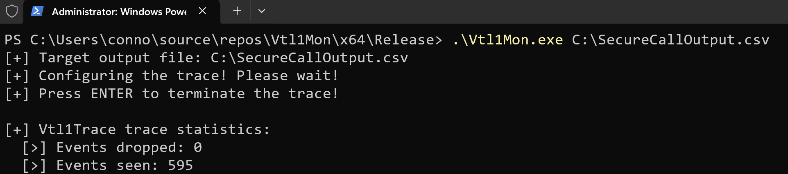

# Vtl1Mon
Vtl1Mon is a tool which leverages ETW (and some undocumented ETW values/event data) to trace all "secure calls" (e.g., calls to `nt!VslpEnterIumSecureMode` which allow, for example, NT to request the services of the Secure Kernel) on Windows. These events are call stack and symbol enhanced, providing information about the type of secure call that was made and the correlated callstack with symbols (if possible). This data is then written to a user-provided CSV file path.

Please see Usage and Caveats for more information.

## Output


|TIMESTAMP    |SECURE CALL NUMBER                       |PROCESS ID|THREAD ID|CALL STACK                                                                                                                                                                                                                                                                                                                                                                                                                                                                                                                                                                                                                                                                                                                                                                                                                                                                                                                                                                                                                                                                                                                                                                                                                                                                                                                                                                                                                                                                                                                               |
|-------------|-----------------------------------------|----------|---------|-----------------------------------------------------------------------------------------------------------------------------------------------------------------------------------------------------------------------------------------------------------------------------------------------------------------------------------------------------------------------------------------------------------------------------------------------------------------------------------------------------------------------------------------------------------------------------------------------------------------------------------------------------------------------------------------------------------------------------------------------------------------------------------------------------------------------------------------------------------------------------------------------------------------------------------------------------------------------------------------------------------------------------------------------------------------------------------------------------------------------------------------------------------------------------------------------------------------------------------------------------------------------------------------------------------------------------------------------------------------------------------------------------------------------------------------------------------------------------------------------------------------------------------------|
|2273647777875|SECURESERVICE_FAST_FLUSH_RANGE_LIST (241)|1452      |8932     |\SystemRoot\system32\ntoskrnl.exe!KeExpandKernelStackAndCalloutInternal + 51&#124;\SystemRoot\system32\ntoskrnl.exe!EtwpTraceStackWalk + 436&#124;\SystemRoot\system32\ntoskrnl.exe!EtwpLogKernelEvent + 1819&#124;\SystemRoot\system32\ntoskrnl.exe!EtwTraceKernelEvent + 151&#124;\SystemRoot\system32\ntoskrnl.exe!VslpEnterIumSecureMode + 513&#124;\SystemRoot\system32\ntoskrnl.exe!VslFastFlushSecureRangeList + 216&#124;\SystemRoot\system32\ntoskrnl.exe!HvlFlushRangeListTb + 961&#124;\SystemRoot\system32\ntoskrnl.exe!MiFlushTbList + 2466&#124;\SystemRoot\system32\ntoskrnl.exe!MiSetReadOnlyOnSectionView + 503&#124;\SystemRoot\system32\ntoskrnl.exe!MmSecureVirtualMemoryAgainstWrites + 334&#124;\SystemRoot\system32\ntoskrnl.exe!AlpcpExposeViewAttributeInSenderContext + 169&#124;\SystemRoot\system32\ntoskrnl.exe!AlpcpDispatchReplyToWaitingThread + 737&#124;\SystemRoot\system32\ntoskrnl.exe!AlpcpSendMessage + 2195&#124;\SystemRoot\system32\ntoskrnl.exe!NtAlpcSendWaitReceivePort + 590&#124;\SystemRoot\system32\ntoskrnl.exe!KiSystemServiceCopyEnd + 37&#124;                                                                                                                                                                                                                                                                                                                                                                                                                                                                                                                 |
|2273647778868|SECURESERVICE_FAST_FLUSH_RANGE_LIST (241)|4568      |27808    |\SystemRoot\system32\ntoskrnl.exe!KeExpandKernelStackAndCalloutInternal + 51&#124;\SystemRoot\system32\ntoskrnl.exe!EtwpTraceStackWalk + 436&#124;\SystemRoot\system32\ntoskrnl.exe!EtwpLogKernelEvent + 1819&#124;\SystemRoot\system32\ntoskrnl.exe!EtwTraceKernelEvent + 151&#124;\SystemRoot\system32\ntoskrnl.exe!VslpEnterIumSecureMode + 513&#124;\SystemRoot\system32\ntoskrnl.exe!VslFastFlushSecureRangeList + 216&#124;\SystemRoot\system32\ntoskrnl.exe!HvlFlushRangeListTb + 961&#124;\SystemRoot\system32\ntoskrnl.exe!MiFlushTbList + 2466&#124;\SystemRoot\system32\ntoskrnl.exe!MiDecommitPagesTail + 83&#124;\SystemRoot\system32\ntoskrnl.exe!MiDeleteVaDirect + 1477&#124;\SystemRoot\system32\ntoskrnl.exe!MiDeletePagablePteRange + 438&#124;\SystemRoot\system32\ntoskrnl.exe!MiDeleteVirtualAddresses + 75&#124;\SystemRoot\system32\ntoskrnl.exe!MiDeleteVad + 383&#124;\SystemRoot\system32\ntoskrnl.exe!MiUnmapVad + 73&#124;\SystemRoot\system32\ntoskrnl.exe!MiUnmapViewOfSection + 311&#124;\SystemRoot\system32\ntoskrnl.exe!AlpcViewDestroyProcedure + 388&#124;\SystemRoot\system32\ntoskrnl.exe!AlpcpDereferenceBlobEx + 248&#124;\SystemRoot\system32\ntoskrnl.exe!AlpcViewDestroyProcedure + 423&#124;\SystemRoot\system32\ntoskrnl.exe!AlpcpDereferenceBlobEx + 248&#124;\SystemRoot\system32\ntoskrnl.exe!AlpcpCaptureViewAttribute + 190&#124;\SystemRoot\system32\ntoskrnl.exe!AlpcpCaptureAttributes + 953&#124;\SystemRoot\system32\ntoskrnl.exe!AlpcpSendMessage + 1709&#124;\SystemRoot\system32\ntoskrnl.exe!NtAlpcSendWaitReceivePort + 590&#124;\SystemRoot\system32\ntoskrnl.exe!KiSystemServiceCopyEnd + 37&#124;|
|2273647781562|SECURESERVICE_FAST_FLUSH_RANGE_LIST (241)|1452      |8932     |\SystemRoot\system32\ntoskrnl.exe!KeExpandKernelStackAndCalloutInternal + 51&#124;\SystemRoot\system32\ntoskrnl.exe!EtwpTraceStackWalk + 436&#124;\SystemRoot\system32\ntoskrnl.exe!EtwpLogKernelEvent + 1819&#124;\SystemRoot\system32\ntoskrnl.exe!EtwTraceKernelEvent + 151&#124;\SystemRoot\system32\ntoskrnl.exe!VslpEnterIumSecureMode + 513&#124;\SystemRoot\system32\ntoskrnl.exe!VslFastFlushSecureRangeList + 216&#124;\SystemRoot\system32\ntoskrnl.exe!HvlFlushRangeListTb + 961&#124;\SystemRoot\system32\ntoskrnl.exe!MiFlushTbList + 2466&#124;\SystemRoot\system32\ntoskrnl.exe!MiSetReadOnlyOnSectionView + 503&#124;\SystemRoot\system32\ntoskrnl.exe!MmSecureVirtualMemoryAgainstWrites + 334&#124;\SystemRoot\system32\ntoskrnl.exe!AlpcpExposeViewAttributeInSenderContext + 169&#124;\SystemRoot\system32\ntoskrnl.exe!AlpcpDispatchReplyToWaitingThread + 737&#124;\SystemRoot\system32\ntoskrnl.exe!AlpcpSendMessage + 2195&#124;\SystemRoot\system32\ntoskrnl.exe!NtAlpcSendWaitReceivePort + 590&#124;\SystemRoot\system32\ntoskrnl.exe!KiSystemServiceCopyEnd + 37&#124;                                                                                                                                                                                                                                                                                |

`(OUTPUT TRUNCATED).....................(OUTPUT TRUNCATED)`

## Usage
Running **as an administrator**, you can use the following command:

`.\Vtl1Mon.exe C:\Path\To\Output\File.csv`

## Caveats
Firstly, you must have Virtualization-Based Security (VBS) enabled to see VTL 1 enter/exit events.

Vtl1Mon hardcodes the symbol path to: `srv*C:\\Symbols*http://msdl.microsoft.com/download/symbols`. You can expect symbol downloads to, thus, reside in `C:\Symbols.` If you would like to change the symbol path, it is not variable, but you can edit `Vtl1Mon/Source Files/Symbols.cpp` at this line:

```c
if (SymSetSearchPathW_I(GetCurrentProcess(),
                        L"srv*C:\\Symbols*http://msdl.microsoft.com/download/symbols") == FALSE)
{
    wprintf(L"[-] Error! SymSetSearchPathW failed in InitializeSymbols. (GLE: %d)\n", GetLastError());
    goto Exit;
}
```

There will be no releases associated with this tool (you must compile from source). Additionally, the built-in Windows debugging DLLs (`dbghelp.dll`, etc.) are known to be broken. Because of this, I have shipped the "correct" DLLs from the Windows SDK in the `Vtl1Mon/SymbolDlls` directory. If you do not feel comfortable using the binaries I have provided, simply replace them with `dbghelp.dll` and `symsrv.dll` (64-bit versions) from the SDK.

Vtl1Mon compiled artifacts will rely on _relative_ paths internally, so when you compile please do not move the compiled binaries from the build directory to run it. Simply run the tool from the appropriate output path. For example, run the tool from `Vtl1Mon\x64\Release\Vtl1Mon.exe`.

You may notice sometimes Vtl1Mon does not immediately start tracing, and may take about 10-30 seconds. The reason can be seen in `Vtl1Mon/Source Files/Callback.cpp`:

```c
if ((opcode != IMAGE_LOADED_RUNDOWN_OPCODE) &&
    (opcode != IMAGE_LOADED_OPCODE))
{
    //
    // We do not get a rundown "end" event with image loads.
    // So we use a "hack" here. The first image unload event
    // we get indicates that the rundown must be over.
    //
    if (opcode == IMAGE_LOADED_UNLOAD)
    {
        //
        // One-time init
        //
        if (!k_ImageRunDownComplete)
        {
            k_ImageRunDownComplete = true;

            //
            // Set the event
            //
            SetEvent(g_EnableVtl1EnterExitEvent);
        }
    }

    goto Exit;
}
```

For symbol-enhancing we "pre-populate" a list of loaded images at the time the trace started. This is known as a _rundown_. However, it seems (at least on the version of Windows this was primarily tested on) there is no associated "image load rundown is complete" ETW event. Because of this we use a little bit of a "hack" and wait for the first image _unload_ to occur - because image load rundown events should come in before any "regular" load image event. Because of this, we do not start processing VTL 1 enter/exit events until after the rundown is finished. All that to say, it may take a few moments after Vtl1Mon is started for the rundown to end, giving the apperance of a "hang". Do not worry, eventually an image unload will occur and your events will start arriving! The console output for Vtl1Mon will provide more updates.